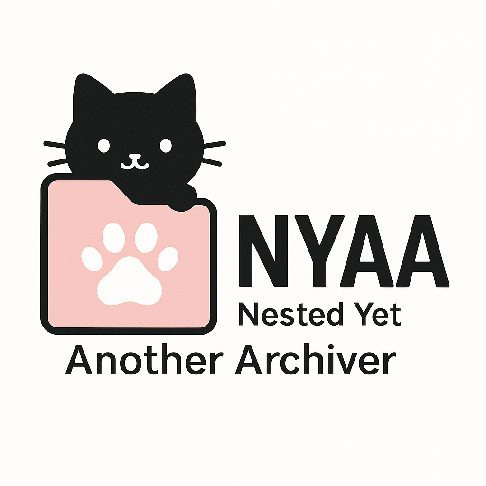

<p align="center">
  
</p>

# NYAA — Nested Yet Another Archiver 🐾 

NYAA is a simple Python-based archiver that supports compression (Zstandard), optional encryption (AES‑256‑GCM), and a GUI built with `tkinter`.

---

## Features

- 🔒 Optional AES-256-GCM encryption
- 🗜 Zstandard compression (1–22)
- 🧃 Small, readable `.nyaa` format
- 🐱 Cute archive messages
- 🖼 Minimalistic GUI with drag-and-drop queue

---

## 📂 Project structure

```txt
📁 nyaa/
├── 📁 src/               # Source code
│   ├── nyaa.py           # Archive core (write/list/extract)
│   └── nyaa_gui.py       # GUI (tkinter-based)
├── 📁 assets/            # Icons and banner
│   ├── badge.ico         # Application icon
│   ├── banner.png        # GUI header banner
│   └── logo.png          # GitHub logo
├── .gitignore
├── .gitattributes
├── LICENSE
├── README.md
└── requirements.txt